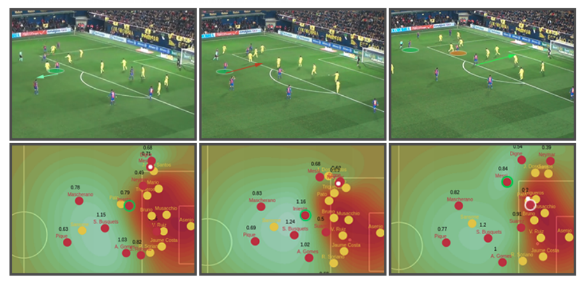
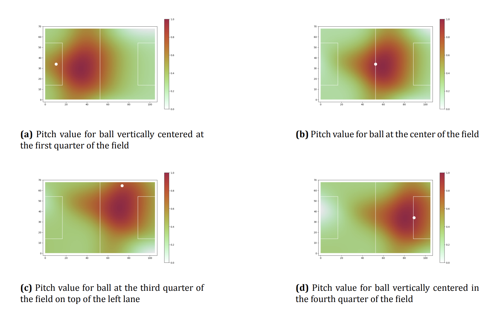
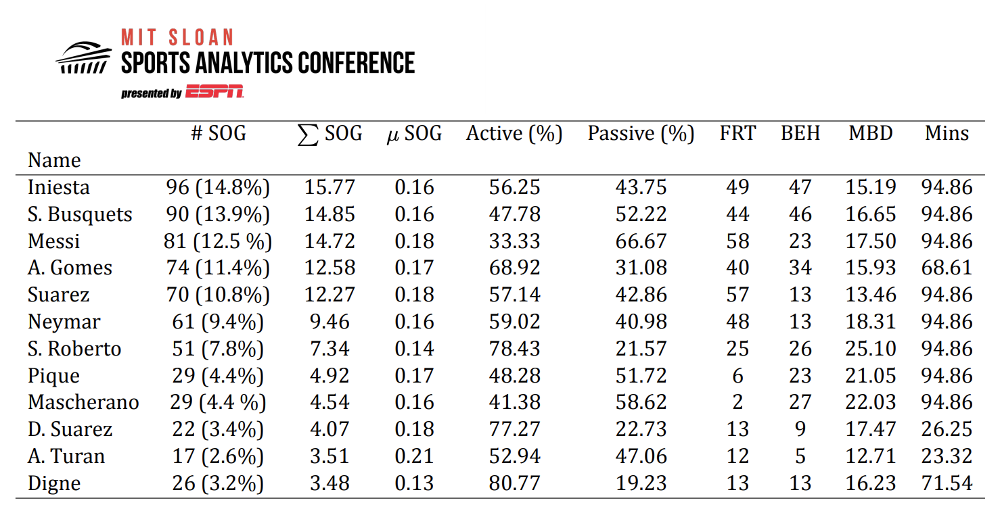

# Data Insight 2 - Space Utilization

For this week's data insight, I chose to dive into agent based modeling in sports. More specifically, I chose to look at quantifying off ball activities in soccer matches. Javier Fernandez and Luke Bornn attempt this in their paper Wide Open Spaces: A statistical technique for measuring space creation in professional soccer. 

"Soccer analytics has long focused on the outcomes of discrete, on-ball events; however, much of the sport’s complexity resides in off-ball events. In the words of Johan Cruyff: “it is statistically proven that players actually have the ball 3 minutes on average. So, the most important thing is: what do you do during those 87 minutes when you do not have the ball? "

Javier Fernandez (F.C. Barcelona) and Luke Bornn (Simon Frasier University, Sacramento Kings) quantified space utilization as:

* Space Occupation - Space created for oneself, a player moving into an open area of the pitch.
  * Active occupation - when a player runs away from a defender, aka actively looking to create space for themselves.
  * Passive occupation - when a player walks / jogs into an empty space, almost by chance.
* Space Creation - Space created for another player, a player moving (and dragging a defender with them) to create space for a teammate.

#### Figure 1: Example of creation and occupation

This figure represents 3 frames of a play from left to right. 

Frame 1:  Andrés Iniesta (circled in green) runs backward to loose his defender, generating space behind them. 

Frame 2: Iniesta recognizes the space behind the defender than runs passed his defender to occupy the space that was created.

Frame 3: Iniesta's off the ball movement offset the defense enough to open a passing lane to Messi on the corner of the penalty area.

#### Pitch Value

Now that we have quantified what space creation looks like, one must understand that occupying and generating space in the oppositions penalty area is significantly more valueable than the same space creation / occupation in a team's own half. This is the case as creating space in the other team's penalty box is a lot more likely to lead to a goal than the same movement's at the halfway line.

Additionally, one must also consider the position of the ball when quantifyign the value of the pitch. This is the case as defenders are mainly conserned with what the opposing team is going to do with the ball. If a player never touches the ball they will have little to no impact on the final score line. For example, the space by a team's goalkeeper is worthless when the ball is in the other team's penalty area. As a result Bornn and Fernandez utilized a dynamic system to value areas of the pitch based on the position of the ball. 

#### Figure 2: Dynamic Pitch Value

#### Metrics for F.C. Barcelona 

After establishing metrics for off the ball movement, Bornn and Fernandez analyzed a F.C. Barcelona game in La Liga, Spain's premier soccer league.

#### Figure 3: Player Stats

The figure above displays the in game stats for Barcelona players in a single game.

* #SOG (%) - Number of times a player occupied / generated space.
* ∑ SOG - Sum of space occupied / generated.
  * More points are given to players who occupy / generate space in more dangerous areas of the pitch.
* μ SOG - Mean value of a player's occupation and generation.
  * This metric quantifies how valuable the a player's movement was on average throughout the match.
* Active (%)  - % of movement that a player was active generation / occupation.
* Passive (%) - % of movement that a player was passive generation / occupation.
* FRT - # of times a player's movement was ahead of the ball.
* BEH - # of times a player's movement was behind the ball.
* MBD - Average distance to ball. 
  * How far a player's movement was to the ball on average. 
* Mins - # of minutes played.

#### Analysis

Lionel Messi, arguably the greatest soccer player of all time, is known for his talent of sneaking himself into dangerous position generates most of his space passively to attract the least amount of attention as possible. Messi also makes most of his moves infront of the ball, which makes sense as he normally plays in a very advanced / attacking role. 

Lucas Digne's metrics are also worth noting. As a left back, Digne makes most of his moves overlapping more attacking players on the flanks of the pitch. Our data reflects this as not only do we report that 80% of his space creation occupation / generation is active. Additionally, the mean value of Digne's movement is significantly lower than Messi or other attacking players, this makes sense as space on the edges of the field will almost always be less valueable than space closer to the center of the field.
