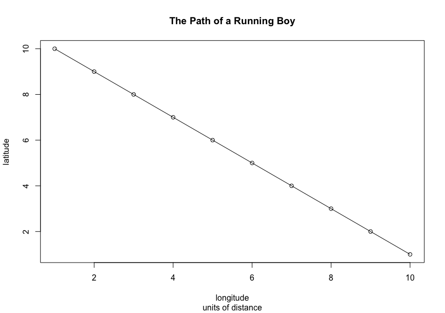
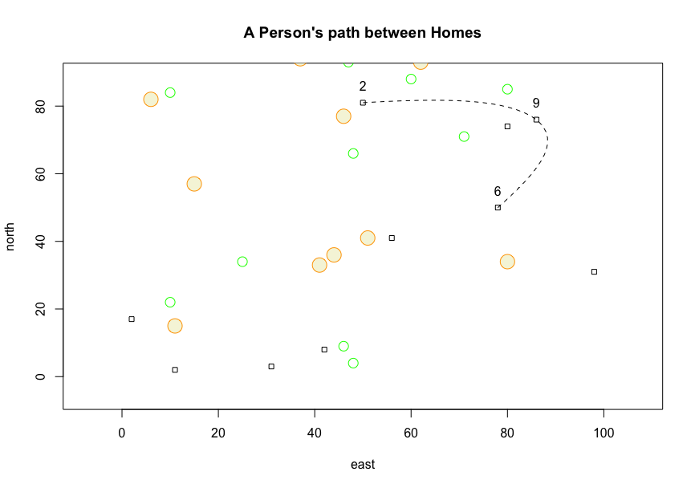

# ExerciseMD


### Exercise 1 - Getting Started with R & R Studio

**Responsibilities**:

- Plot generated data on an individual's path between homes


Initiate variables.

```R
x <- 1:10
y <- 10:1
```

Plot relationship between x and y.

```R
plot(x,y,type='o',
     main='The Path of a Running Boy',
     sub='units of distance',
     xlab='longitude',
     ylab='latitude',
     col='blue',
     lwd=.75,
     pch=0,
     cex=1.5,
     lty=2)
```



Complicate Relationship between x and y, add obstacles, and the indvidual's path.

```R
x<-1:100
y<-1:100
east<-sample(x,size=10,replace=T)
north<-sample(y,size=10,replace=T)
symbols(east,north, squares=rep(1,10),inches=F,fg='black')
symbols(sample(x,size=10,replace=T),
        sample(x,size=10,replace=T),
        circles = rep(1,10),
        inches=F,
        add=T,
        fg='green')
symbols(sample(x,size=10,replace=T),
        sample(x,size=10,replace=T),
        circles = rep(1.5,10),
        inches=F,
        add=T,
        fg='orange',
        bg='beige')
dwellings <- cbind.data.frame(id=1:10,east,north)
locs <- sample(1:10, 3, replace = F)
text(x = dwellings[locs,]$east,
     y= dwellings[locs,]$north+5,
     labels= dwellings[locs,]$id)
xspline(x = dwellings[locs,2],
        y = dwellings[locs,3],
        shape=-1,
        lty=2)
title(main="A Person's path between Homes")
```



**Challenge Question**

- Increase the minimum and maximum limits of your area from 1 to 1000 in both the x & y dimension.
- Randomly place 50 dwelling units throughout the 1000 x 1000 dimensioned area. Size each square appropriately.
- Randomly place 40 small circles (trees) throughout the 1000 x 1000 dimensioned area. Set the radius of each circle to the same or approximately the same as the width of each home.
- Randomly place 12 large trees throughout the defined area, such that each tree has almost twice the radius as each home's width.
- Randomly select 7 homes from the 50 total, and use a dashed spline to describe the path between each labeled dwelling unit.

```R
x<- 1:1000
y<- 1000:1
east <- sample(x, 50, replace=T)
north <- sample(y, 50, replace=T )
df <- cbind.data.frame(id=1:50, east, north)
symbols(east,north, squares=rep(10,50),inches=F,fg='black')
symbols(sample(x,40,replace=F), 
        sample(y,40,replace=F), 
        circle=rep(10,40),
        inches=F,
        fg='green',
        bg='beige',
        add=T)
symbols(sample(x,12,replace=F),
        sample(y,12,replace=F),
        circle=rep(20,12),
        fg='green',
        bg='beige',
        inches=F,
        add=T)
homes <- sample(df$id, 7, replace=F)
xspline(x = df[homes,2],
       y = df[homes,3],
       shape = -1,
       lty = 2)
text(x = df[homes,2],
     y = df[homes,3]+50,
     labels=df[homes,1])      
title("A Person's Path between Homes ")  
```


