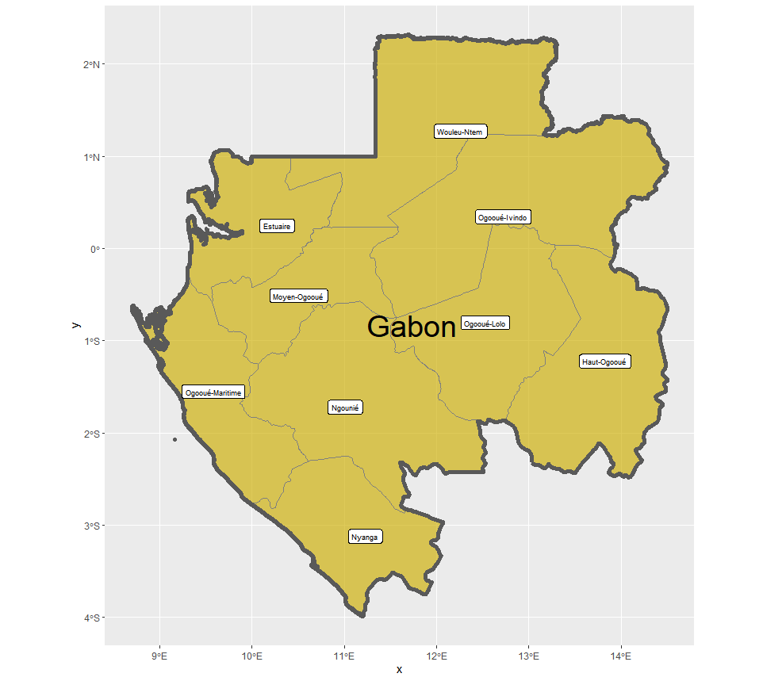
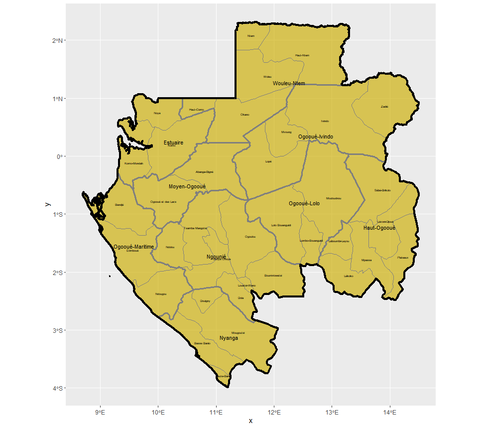
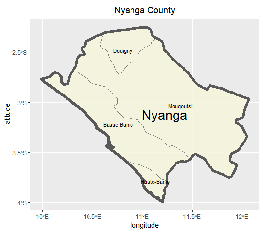

###  Exercise 2 - Projecting, Plotting and Labelling Administrative Subdivisions

**Responsibilites**

- Map out the administrative subdivisions of a country of our chosing.
  - I personally chose to analyze Gabon


Installing and loading packages.

```R
install.packages('tidyverse',dependencies=T)
install.packages('sf',dependencies=T)
library(sf)
library(tidyverse)
```

Read in `.shp` files.

```R
som_int <- read_sf('work/GABON/gadm36_GAB_0.shp')
som_int1 <- read_sf('work/GABON/gadm36_GAB_1.shp')
som_int2 <- read_sf('work/GABON/gadm36_GAB_2.shp')
```

Plot of Gabon's highest 2 levels of regions.

```R
ggplot() +
  geom_sf(data=som_int1,
          size=.65,
          color='gray50',
          fill='gold3',
          alpha=.65) +
  geom_sf(data = som_int,
          size=2,
          alpha=0) +
  geom_sf_label(data = som_int1,
               aes(label=som_int1$NAME_1),
               size=2.5) +
  geom_sf_text(data=som_int,
                aes(label=som_int$NAME_0),
                size=10,
                color='black')

```



Plot of all of Gabon's administrative levels.

```R
ggplot() +
  geom_sf(data=som_int2,
          size=.45,
          color='gray50',
          fill='gold3',
          alpha=.65) +
  geom_sf(data=som_int1,
          size=1.35,
          color='gray50',
          alpha=0) +
  geom_sf(data=som_int,
          size=1.75,
          color='black',
          alpha=0)+
  geom_sf_text(data=som_int2,
               aes(label=som_int2$NAME_2),
               size=1.5)+
  geom_sf_text(data=som_int1,
               aes(label=som_int1$NAME_1),
               size=3)
```



### Challenge Questions

1. Isolate the Nyanga county and plot it's subdivisions.

```R
prov_nyanga <- som_int1 %>%
  filter(som_int1$NAME_1=="Nyanga")
prov_nyanga1 <- som_int2 %>%
  filter(som_int2$NAME_1=="Nyanga")

plotbot <-ggplot() +
  geom_sf(data=prov_nyanga1,
          size=.65,
          color='gray50',
          fill='beige',
          alpha=.85) +
  geom_sf(data = prov_nyanga,
          size=2,
          alpha=0)+
  geom_sf_text(data=prov_nyanga1,
               aes(label=NAME_2),
               size=3)+
  xlab("longitude") + ylab("latitude") +
  ggtitle("Nyanga County") +
  theme(plot.title = element_text(hjust = 0.5))
```




2. Create a composite graphic of Gabon.

   ```R
   mainplot <-ggplot() +
     geom_sf(data=som_int1,
             size=.65,
             color='gray50',
             fill='gold3',
             alpha=.65) +
     geom_sf(data = som_int,
             size=2,
             alpha=0) +
     geom_rect(data = som_int1, xmin = 10.5, xmax = 12., ymin = -4, ymax = -2.5, 
               fill = NA, colour = "black", size = 1.5) +
     geom_rect(data = som_int1, xmin = 11, xmax = 14, ymin = -.35, ymax = 2.3, 
               fill = NA, colour = "black", size = 1.5) +
     geom_sf_text(data = som_int1,
                  aes(label=som_int1$NAME_1),
                  size=2.5) +
     geom_sf_text(data=som_int,
                  aes(label=som_int$NAME_0),
                  size=10,
                  color='black') +
     xlab("longitude") + ylab("latitude") +
     ggtitle("Gabon") +
     theme(plot.title = element_text(hjust = 0.5))
   
   pvo <- som_int1 %>%
     filter(som_int1$NAME_1=="Wouleu-Ntem"|som_int1$NAME_1=="Ogoou?-Ivindo")
   pvo1 <- som_int2 %>%
     filter(som_int2$NAME_1=="Wouleu-Ntem"|som_int2$NAME_1=="Ogoou?-Ivindo")
   
   plottop <-ggplot() +
     geom_sf(data=pvo1,
             size=.65,
             color='gray50',
             fill='beige',
             alpha=.85) +
     geom_sf(data = pvo,
             size=2,
             alpha=0)+
     geom_sf_text(data=pvo1,
                  aes(label=NAME_2),
                  size=3)+
     xlab("longitude") + ylab("latitude") +
     ggtitle("Wouleu Ntem & Ogoou?-Ivindo Counties") +
     theme(plot.title = element_text(hjust = 0.5))
   
   ggplot() +
     coord_equal(xlim = c(0, 6.0), ylim = c(0, 4), expand = FALSE) +
     annotation_custom(ggplotGrob(mainplot), xmin = 0.0, xmax = 4.0, ymin = 0, 
                       ymax = 4.0) +
     annotation_custom(ggplotGrob(plotbot), xmin = 4.0, xmax = 6.0, ymin = 0, 
                       ymax = 2.0) +
     annotation_custom(ggplotGrob(plottop), xmin = 4.0, xmax = 6.0, ymin = 2.0, 
                       ymax = 4.0) +
     theme_void()
   ```


   
