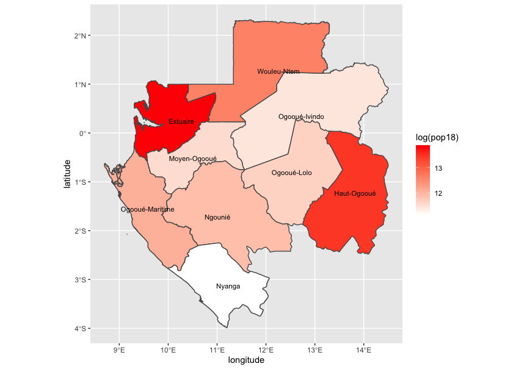

### Ran into a couple problems here
 - Graph was not showing scale / colors. 
 ```R
 ggplot(gab_adm1)+
  geom_sf(fill=gab_adm1$pop18) +
  scale_fill_gradient(low='blue',high='red') +
  geom_sf_text(aes(label=gab_adm1$NAME_1),
               color='black',
               size=4)
 ```
           
           
