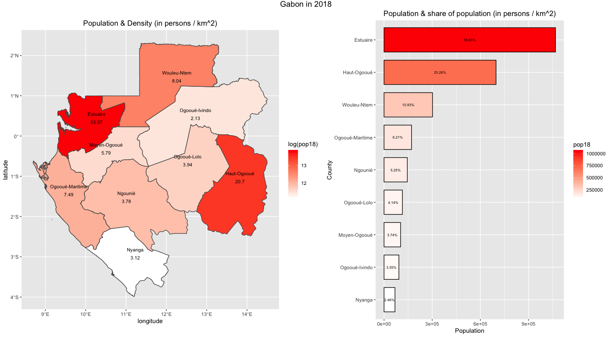

### Exercise 4 - Creating a Geometric Bar Plot with your Simple Feature object

**Responsibilities XXX**

Plot1 

plot 2

plot 3

Plot4 

Plot5

Stretch Goal 1

### I have chosen the Woleu-Ntem region (~300,000 in 2018)

Plot 1

Plot 2

Plot3

