# Final Project

## London Boroughs

Provide a written description of the analysis you conducted of the gravity model for London. Additionally, incorporate the Garcia et al. paper into your description while introducing your the migration data for your selected country. Supplement your introduction with spatial plots that describe in/out migration by adminsitrative subdivision.

As an introduction to gravity models we analyzed the migration patterns of London boroughs.

We started by looking at 7 boroughs:

* Barking and Dagenham
* Barnet
* Bexley
* Brent
* Bromley
* Camden
* City of London

#### Figure 1.1: Distance matrix for selected 7 boroughs


#### Figure 1.2: Observed Migration Matrix

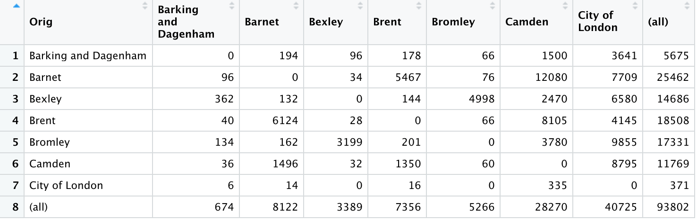

With the above information we were able to create migration graphics. Thicker lines indicate more migration between the two boroughs. As we can see in Figure 1.3 and Figure 1.4, distance between boroughs does not seem to affect migration.

#### Figure 1.3: Migration Graphic of London boroughs

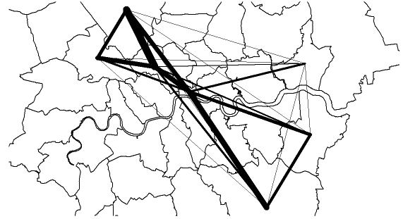

#### Figure 1.4: Migration Graphic of London boroughs transposed on google maps.


#### Figure 1.5: Distance between boroughs X Total Migration between buroughs

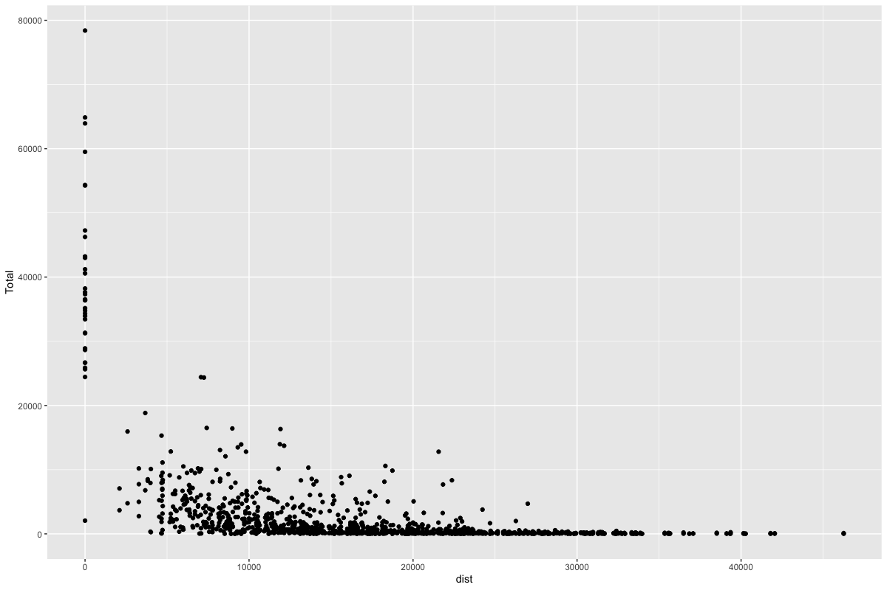

As we can see from Figure 1.5, without manipulating our data there does not really seem to be any strong relationship between distance and total migration. This may result in a weak gravity model, since our model is a function of size of boroughs and distance between boroughs.

#### Figure 1.6: Gravity Model Predicted Migration Patterns

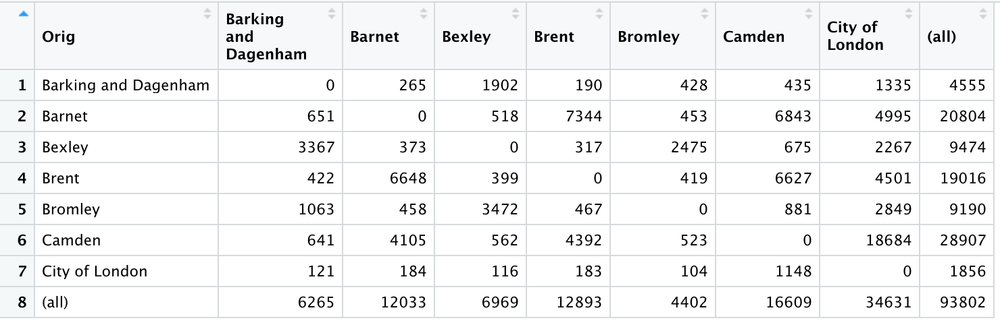

#### Figure 1.7: Observerd Migration Patterns X Gravity Model Predicted Migration Patters 

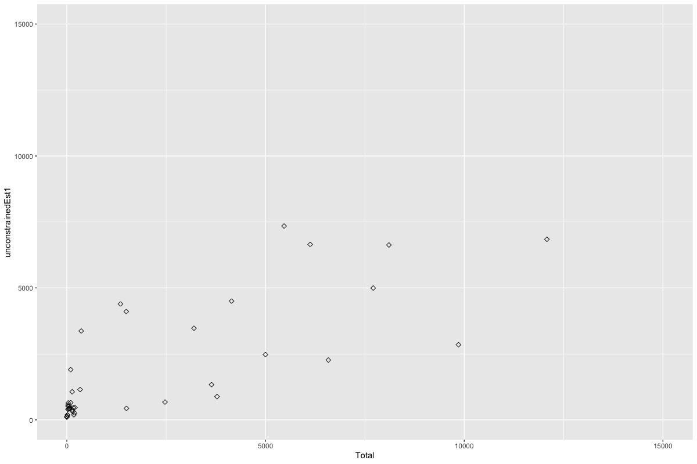

This gravity model returned an r^2 of .5056237 and a RMSE of 2502.24 which is not terrible but could definitely be improved.

I attempted to get a better model by taking the transforming the distance and size of boroughs logarithmically as I noticed some correlation there.

#### Figure 1.8: Log Distance X Log Total

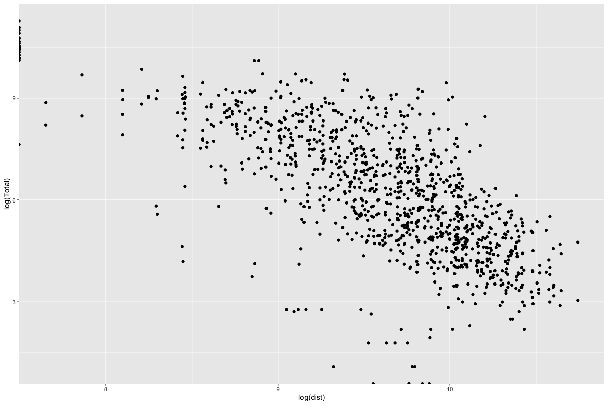

From there, I imported data on borough population and average salaries to better our constant variables in our gravity model. 

```R
uncosim <- glm(Total ~ log(vi1_origpop)+log(wj2_destsal)+log(dist), na.action = na.exclude, family = poisson(link = "log"), data = cdatasub)
k <- uncosim$coefficients[1]
mu <- uncosim$coefficients[2]
alpha <- uncosim$coefficients[3]
beta <- -uncosim$coefficients[4]

cdatasub$unconstrainedEst2 <- exp(k+(mu*log(cdatasub$vi1_origpop))+(alpha*log(cdatasub$wj2_destsal))-(beta*log(cdatasub$dist)))
```

Which ended up bettering our model. As we returned a r^2 of 0.6720501 and a RMSE of 1895.768, which is an improvement.

#### Figure 1.9: Improved Gravity Model Predicted Matrix

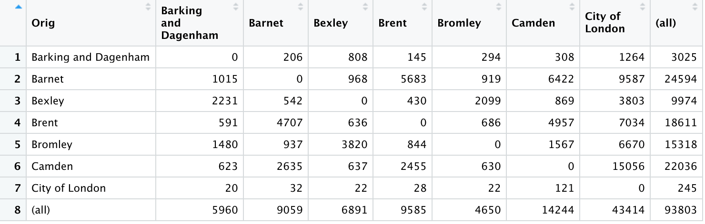

#### Figure 1.10: Improved Gravity Model Predictions X Observed Migration Patterns

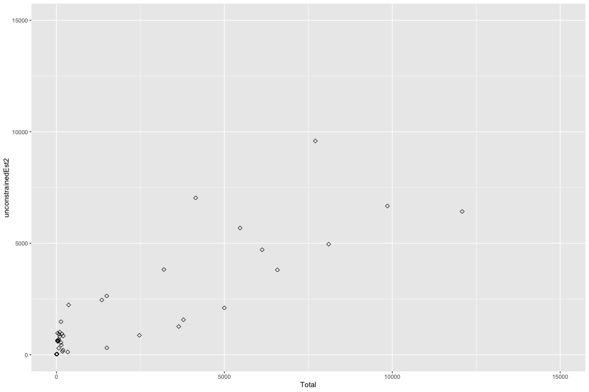

### Animation of Woleu Ntem Province

- Produce an origin-destination matrix and include a portion of it as an exhibit in your write-up. Be sure to identify the number of rows in your data frame while also including the following.

  #### Figure 2.1: Final OD Matrix

  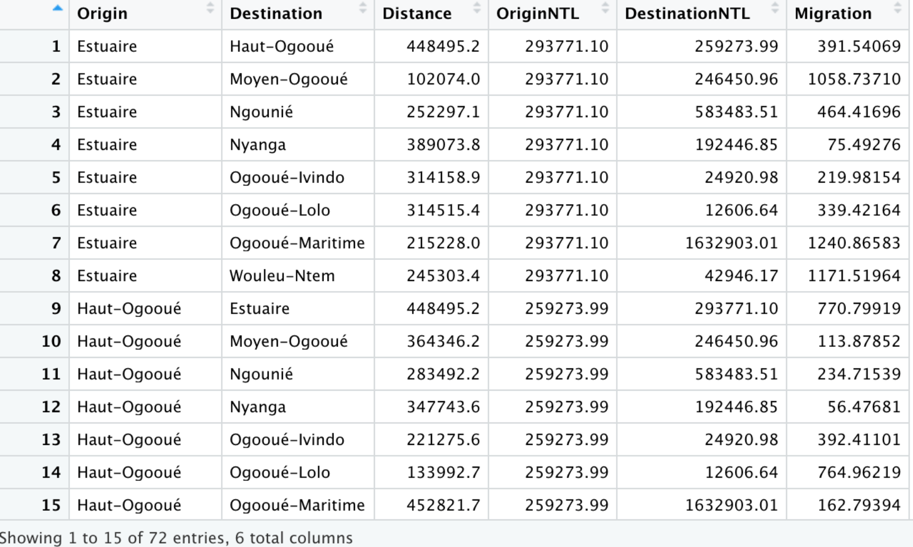

  * Origin - Origin administrative region
  * Destination - Destination administrative region
  * Distance - Distance between origin and destination administrative region in meters.
  * OriginNTL - Nighttime lights in origin administrative region
  * DestinationNTL - Nighttime lights in destination administrative region
  * Migration - Individuals who chose to migrate from origin to destination administrative regions

* Describe your OD matrix and how it is used to model migration across the administrative subdivisions that comprise your selected location.

  My OD matrix uses distance and nighttime lights to predict migration between administrative regions. As we saw in Figure 1.8, log(distance) has an inverse relationship to log(migration) and we can assume that individuals who want to migrate to areas with more nighttime lights.

#### Figure 2.2: Relationship between log(distance) and log(migration) for Gabon.

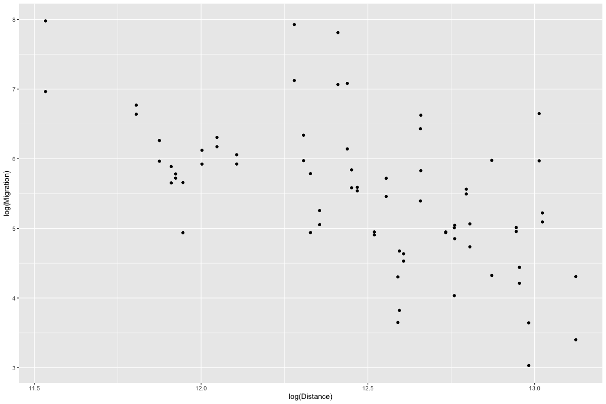


- Produce an animation of migration and elaborate on how your OD matrix and gravity model could be integrated with your simulation.

#### Figure 2.3: Animation

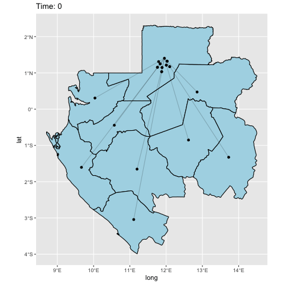

*How would you modify the number of points departing from each origin?*

You can potentially modify the number of points departing from each origin to match the total amount of migration reported. Personally, I would rather size my points in proportion to migration to keep the graphic as clean as possible. As we can see in Figure 2.3, with only one origin destination the graphic is arguably clutered, adding more points would only make that worse.

*How would you modify the time variable? What scale is the temporal dimension at this level?*

Time is not reported, so I assumed we were working with a time period of 6 months. As a result, I plotted 6 different points equally spaced along the line linking origin and destination regions. Going forward, I would love to find a way to incorporate time metrics from WorldPop or WorldPop equivalents to better understand migration patterns of Gabon.

*How would the gravity model update these attributes in order to produce a different simulation of migration that more closely approximates reality?*


### Voronoi Tesselation 

At the level of your selected, higher resolution administrative subdivision (where you produced defacto descriptions of settlements), use the center points of each settlement to produce a tesselation of voronoi polygons. Similar to your analysis of the higher level administrative subdivisions, address the following.

To create my Voronoi polygon, I adapted used code from a previous project and added the lines of code below to transform my selected adm2 sf object into a Voronoi polygon

```R
mk_bb <- st_bbox(WL$geometry) %>% st_as_sfc() 
mk_voronoi <- st_voronoi(st_union(subdiv_cntr_pts), mk_bb) %>% 
  st_collection_extract("POLYGON") 
mk_voronoi_adm2 <- mk_voronoi %>% st_intersection(WL)
```

#### Figure 3.1: Voronoi Polygon

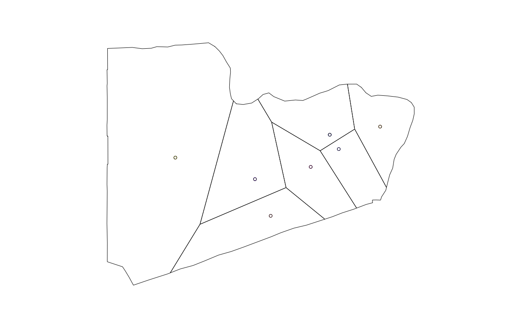

Now that I have 6 Settlements with their own quasi borders and capitals, it is possible to create a higher resolution gravity model of just this region of Gabon. 

*1) How would you produce an OD matrix of these higher resolution entities? Which variables would you include? Are you lacking any data that would improve upon your model results?*

I would create an OD matrix by comparing the distances of my quasi capitals to each other, since they form the center of each settlement. I am not lacking any data for a basic OD matrix, as I already have population estimates for each settlment and with a few lines of code can calculate the distance between each settlement.

*2) How would you modify the number of points departing from each origin? How would you determine each points destination?*

In the animation we only simulate one person migrating from an origin to a destination. We could alter this graphic by adding a size variable to that dot, as in, the size of a dot representing migration of 10 individuals would be proportionally smaller to the size of a dot representing the migration of 100 individuals. I would want to alter the size of our dots instead of adding more to prevent cluter on our graphic.

*3) How would you modify the time variable? What scale is the temporal dimension at this level?*

The time variable in our current graphic is linear in nature. Since we do not have data on time taken to migrate, our point is traveling at a constant speed throughout the migration. I would modify this so that our time variable is almost quadratic in nature, where our point is traveling at its fastest in the middle of the route but slows down at the end of the journey. This better replicates a journey, as you drive a lot slower when your in your neighborhood when compared to driving on a highway.

#### Figure 3.2: Speed of Points During Migration

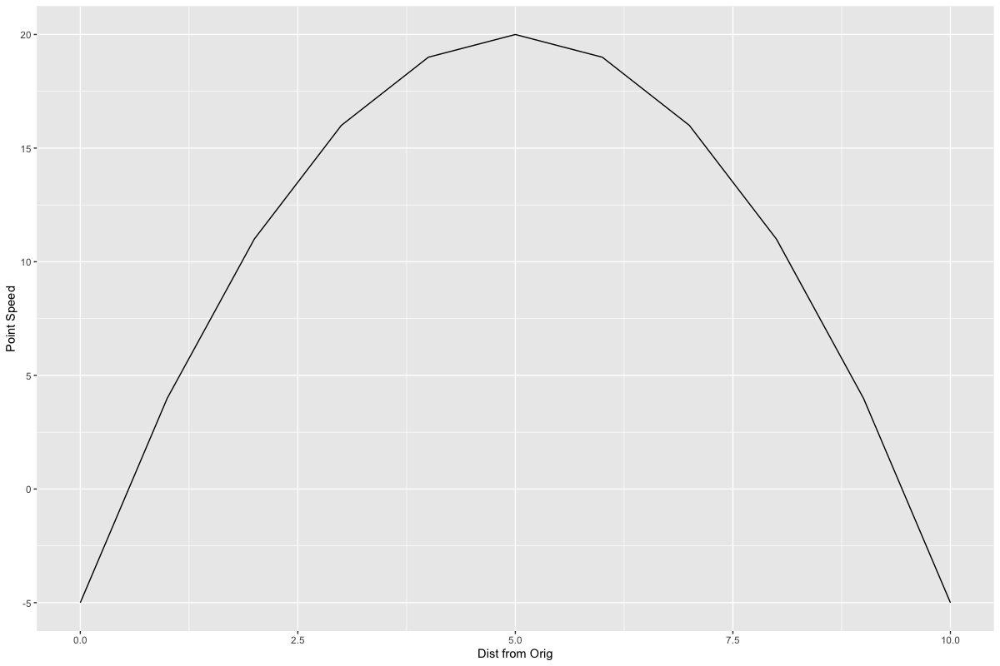

Additionally, points on the current graphic arrive at their destination location at the same time no matter the distance between origin and destination. I would prefer to find a method that demonstrates that it takes less time for a point to travel to a closer location than a farther one.

*4) How would the gravity model update these attributes in order to produce a different simulation of migration?*

I believe that we will not need any adjustment to our gravity model considering the inverse relationship between log(dist) and log(total) in our 2nd gravity model. Due to the fact that our DeFacto settlement are in the same adm2 region, they are going to be a lot closer. Figure 1.8 shows that a decrease in log(dist) leads to an increase in log(total) in our gravity model. As a result, the model already accomidates for higher resolution migration patterns.

*5) How would you go about integrating migration and transport activities at the differing geospatial and temporal scales of these hierarchical levels?*

Migration on a smaller scale happens more frequently and in less time. Just like commuting to work happens almost daily, yet a trip to see family across the country might only happen once a year. As a result, we would just need to adjust the distance and time variables in our model to better understand how migration patterns in different hierarchal levels.


