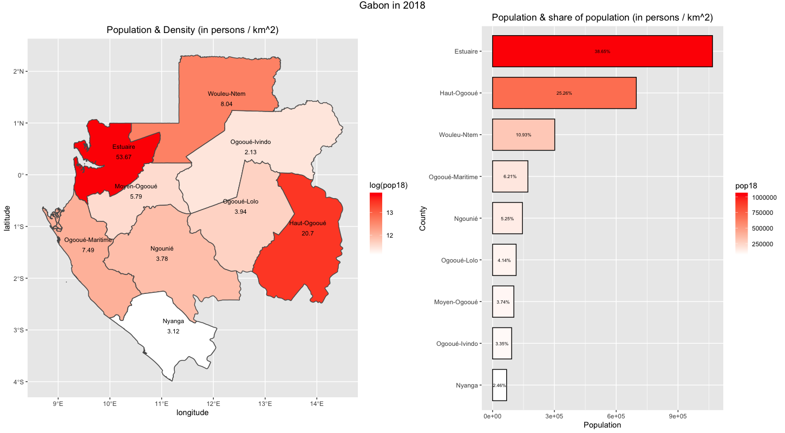
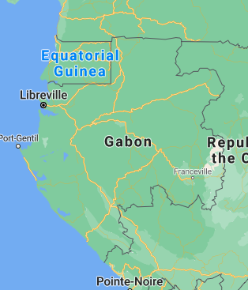
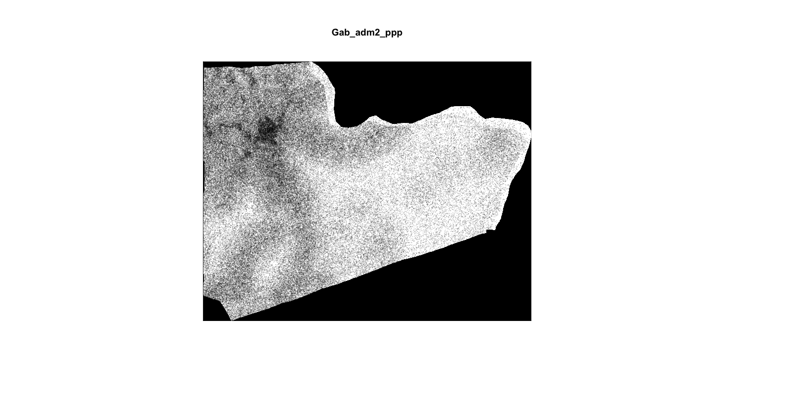
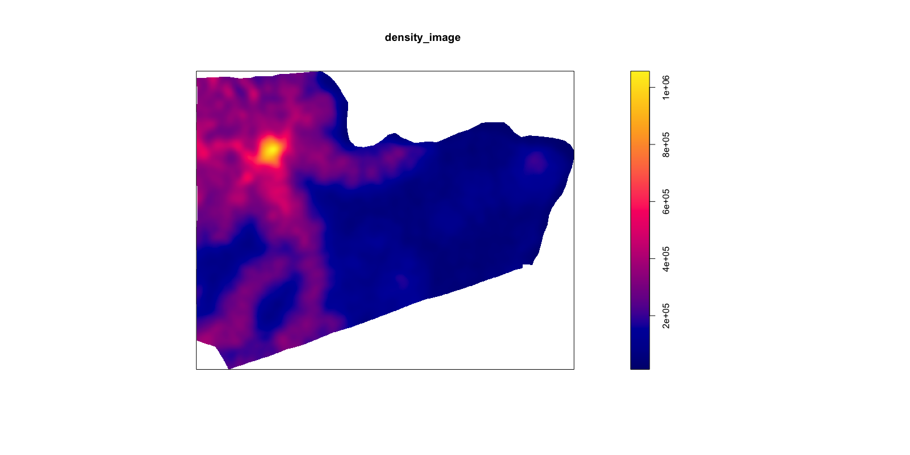
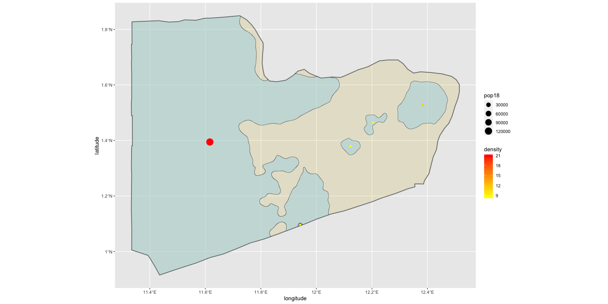
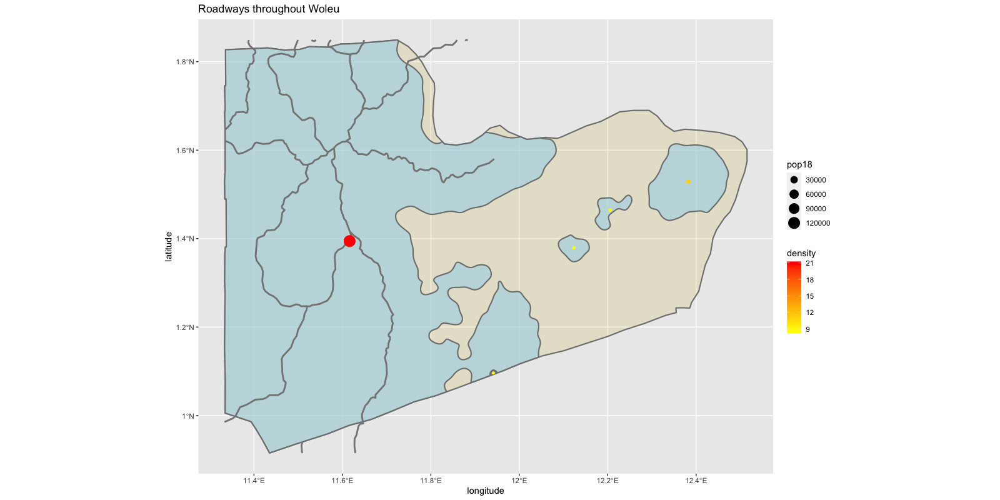
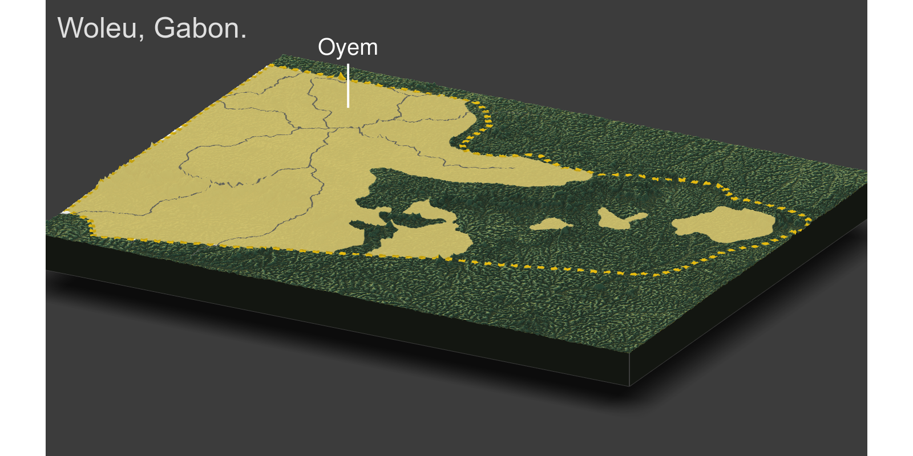
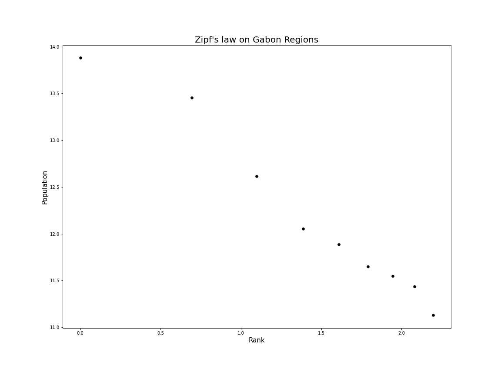
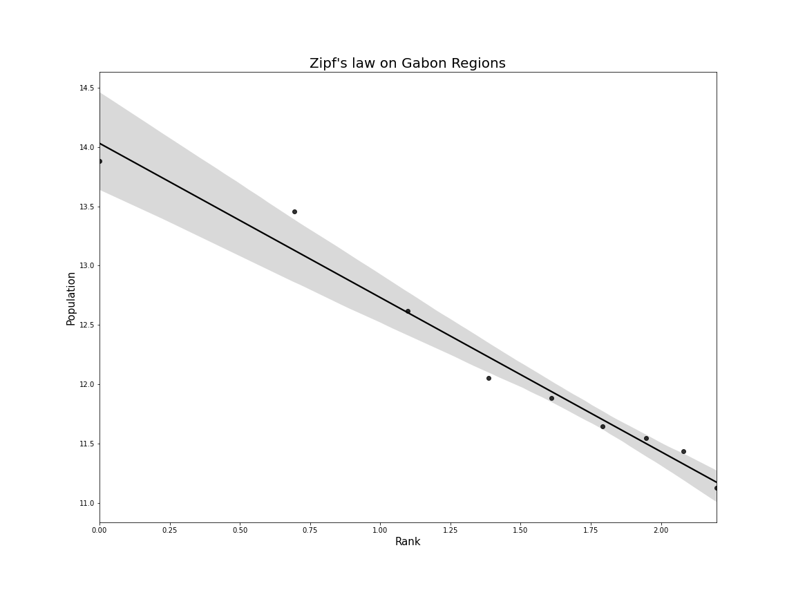

### Project 1 

For this first project I have chosen to analyze Gabon.

##### Creating a Geometric Bar Plot:

```R
library(sf)
library(tidyverse)
library(raster)
library(units)
library(scales)
library(ggrepel)
library(ggpubr)

gab_adm1 <- gab_adm1 %>%
  mutate(area = sf::st_area(gab_adm1) %>%
           units::set_units("km^2")) %>%
  mutate(density = pop18/area)

r <-gab_adm1 %>%
  mutate(NAME_1= fct_reorder(NAME_1, pop18)) %>%
  ggplot(aes(x=NAME_1, y=pop18, fill=pop18))+
  geom_bar(stat="identity", color='black', width=.75)+
  geom_text(aes(label=percent(pop18/sum(pop18))),
            position = position_stack(vjust=.5), size=2.25)+
  coord_flip()+
  scale_fill_gradient(low='white',high='red')+
  xlab('County')+ylab('Population')+ggtitle('Population & share of population (in persons / km^2)')+
  theme(plot.title = element_text(hjust = 0.5))


l <-ggplot(gab_adm1) +
  geom_sf(aes(fill = log(pop18))) +
  geom_sf_text(aes(label = NAME_1),
               color = "black",
               size = 3,nudge_y=.3) +
  geom_sf_text(aes(label=round(density,2)), size=3,nudge_y=.1)+
  scale_fill_gradient(low = "white", high = "red") +
  xlab('longitude') + ylab('latitude') + ggtitle('Population & Density (in persons / km^2)')+
  theme(plot.title = element_text(hjust = 0.5))

ggarrange(l, r, nrow=1, widths= c(2.25,2)) + ggtitle('Gabon in 2018') +
  theme(plot.title = element_text(hjust = 0.5),
        axis.title=element_text(size=26,face="bold"))
```




From the graphic above we can see that most of the Gaboneese population is centered around the Esuaire and Haut-Ogooue region. 

* Libreville, located in the Estuaire region, is not only the country's capital but is also a port city on the western coast of Africa. As a result, we can expect a large portion of the Gabon's population to settle in that region. 
* The Haut-Ogooué region also holds a signifcant portion of Gabon's population, the only reasonable explanation of this is that the Haut-Ogooué region shares a border with the Republic of Congo. This might be a reason that the city of Franceville is located in the region.




##### De Facto Descriptions of Human Settlements 

*** I have chosen to narrow my analysis to the Woleu county of the Woleu-Ntem province in Northern Gabon due to the computing time it would take to spatially analyze the a larger area.

```R
library(sf)
library(raster)
library(tidyverse)
library(maptools)
library(spatstat)
library(units)

Gab_pop <- raster('gab_ppp_2018.tif')
Gab_adm2 <- read_sf('GABON/gadm36_GAB_2.shp')

WL <- Gab_adm2 %>%
  filter(NAME_2 == "Woleu")

Gab_adm2_pop <- crop(Gab_pop, WL)
Gab_adm2_pop <- mask(Gab_adm2_pop, WL)

pop <- floor(cellStats(Gab_adm2_pop,'sum'))

## pop = 138978


st_write(WL, "WL.shp", delete_dsn=T)
WL_mtools <- readShapeSpatial('WL.shp')

win <- as(WL_mtools, "owin" )

Gab_adm2_ppp <- rpoint(pop, f = as.im(Gab_adm2_pop), win=win)

plot(win, main="FINAL")
plot(Gab_adm2_ppp,  cex = .05)


density_image <- density.ppp(Gab_adm2_ppp, sigma=bw)
plot(density_image)


Dsg <- as(density_image, "SpatialGridDataFrame")  # convert to spatial grid class
Dim <- as.image.SpatialGridDataFrame(Dsg)  # convert again to an image
Dcl <- contourLines(Dim, levels = 100000)  # create contour object
SLDF <- ContourLines2SLDF(Dcl, CRS("+proj=longlat +datum=WGS84 +no_defs"))
SLDFs <- st_as_sf(SLDF, sf)

# png("sm_dsg_conts.png", width = 1200, height = 1200)
plot(Dsg, main = NULL)
plot(SLDFs, add = TRUE)
```






* As we can see from this rpoint graphic, there seems to be 1 ( arguably 2) settlements that individuals in the Woleu county have chosen to settle around. 

```R
Dsg <- as(density_image, "SpatialGridDataFrame")  # convert to spatial grid class
Dim <- as.image.SpatialGridDataFrame(Dsg)  # convert again to an image
Dcl <- contourLines(Dim, levels = 100000)  # create contour object
SLDF <- ContourLines2SLDF(Dcl, CRS("+proj=longlat +datum=WGS84 +no_defs"))
SLDFs <- st_as_sf(SLDF, sf)


inside_polys <- st_polygonize(SLDFs)
outside_lines <- st_difference(SLDFs, inside_polys)
outside_buffers <- st_buffer(outside_lines, 0.001)
outside_intersects <- st_difference(WL, outside_buffers)
oi_polys <- st_cast(outside_intersects, "POLYGON")
in_polys <- st_collection_extract(inside_polys, "POLYGON")
in_polys[ ,1] <- NULL
oi_polys[ ,1:15] <- NULL
# in_polys <- st_cast(in_polys, "POLYGON")
# oi_polys <- st_cast(oi_polys, "POLYGON")
all_polys <- st_union(in_polys, oi_polys)
all_polys <- st_collection_extract(all_polys, "POLYGON")
all_polys <- st_cast(all_polys, "POLYGON")
all_polys_subdiv <- all_polys %>%
  unique()


all_polys_ext <- raster::extract(Gab_pop, all_polys_subdiv, df = TRUE)

all_polys_ttls <- all_polys_ext %>%
  group_by(ID) %>%
  summarize(pop18 = sum(gab_ppp_2018, na.rm = TRUE))

all_polys_subdiv <- all_polys_subdiv %>%
  add_column(pop18 = all_polys_ttls$pop18) %>%
  mutate(area = as.numeric(st_area(all_polys_subdiv) %>%
                             set_units(km^2))) %>%
  mutate(density = as.numeric(pop18 / area))

all_polys_subdiv <- all_polys_subdiv %>%
  filter(area > 3100 | area<2900 ) %>%
  filter(density >8) %>%
  filter(area>7 | area <6.2)


subdiv_cntr_pts <-  all_polys_subdiv %>% 
  st_centroid() %>% 
  st_cast("MULTIPOINT")
ggplot() +
  geom_sf(data = WL,
          size = 0.75,
          color = "gray50",
          fill = "gold3",
          alpha = 0.15) +
  geom_sf(data = all_polys_subdiv,
          fill = "lightblue",
          size = 0.25,
          alpha = 0.5) +
  geom_sf(data = subdiv_cntr_pts,
          aes(size = pop18,
              color = density),
          show.legend = 'point') +
  scale_color_gradient(low = "yellow", high = "red") +
  xlab("longitude") + ylab("latitude") 
```



* As I believed before, there are two main settlement areas in Woleu, the larger in the north west of the region which I suspect to be a small city/town (based off of density / population values). 
* On the other hand, I suspect that the second settlement closest to the eastern border of the region might be farmland.

##### Adding Transportation & Healthcare Services:

** It should be noted that I was unable to find a dataset with healthcare facilities in the Woleu county. I believe this demonstrates how rural / underdeveloped the Woleu area is.

```R
gab_topo <- read_sf('GAB_rds/GAB_roads.shp')
gab_adm2 <- read_sf('GABON/gadm36_GAB_2.shp')
WL <- gab_adm2 %>%
  filter(NAME_2=='Woleu')
wl_roads <- st_crop(gab_topo, WL)

table(wl_roads$RTT_DESCRI)

secondary <- wl_roads %>%
  filter(RTT_DESCRI=='Secondary Route')


#Ex6plot1
ggplot() +
  geom_sf(data = WL,
          size = 0.75,
          color = "gray50",
          fill = "gold3",
          alpha = 0.15) +
  geom_sf(data = all_polys_subdiv,
          size = 0.75,
          color = "gray50",
          fill = "lightblue",
          alpha = 0.65) +
  geom_sf(data = secondary,
          size = 1,
          color = "gray52") +
  geom_sf(data = subdiv_cntr_pts,
          aes(size = pop18,
              color = density),
          show.legend = 'point') +
  scale_color_gradient(low = "yellow", high = "red") +
  xlab("longitude") + ylab("latitude") +
  ggtitle("Roadways throughout Woleu")
```



* Adding transport to this graphic further demonstrates how underdeveloped the region is, as there were no "primary" roads in the region and "secondary" roads only run through the western side of the region. 
* It should also be noted that some roads appear to be dead ends / disappear. Out of curiousity, I plotted all transport services,  including roads that were classified as worse than "secondary" and I discovered that dead end "secondary" roads turn into smaller dirt roads.

##### Rendering Topography

```R
library(rayshader)
library(rayrender)

gab_top <- raster("srtm_39_12.tif")
topo <- crop(gab_top,WL)
gab_matrix <- raster_to_matrix(topo)

#ex7plot1
gab_matrix %>%
  sphere_shade()%>%
  add_water(detect_water(gab_matrix)) %>%
  plot_map()

ambientshadows <- ambient_shade(gab_matrix)

gab_matrix %>%
  sphere_shade() %>%
  add_water(detect_water(gab_matrix), color = "lightblue") %>%
  add_shadow(ray_shade(gab_matrix, sunaltitude = 3, zscale = 33, lambert = FALSE), max_darken = 0.5) %>%
  add_shadow(lamb_shade(gab_matrix, sunaltitude = 3, zscale = 33), max_darken = 0.7) %>%
  add_shadow(ambientshadows, max_darken = 0.1) %>%
  plot_3d(gab_matrix, zscale = 20,windowsize = c(1000,1000), 
          phi = 40, theta = 135, zoom = 0.5, 
          background = "grey30", shadowcolor = "grey5", 
          soliddepth = -50, shadowdepth = -100)
#ex7plot2
render_snapshot(title_text = "Woleu, Gabon", 
                title_size = 50,
                title_color = "grey90")

#ex7plot3
border <- ggplot()+
  geom_sf(data=WL,
          size=4.5,
          color='gold',
          linetype="11",
          alpha=0)+
  theme_void() + theme(legend.position="none") +
  scale_x_continuous(expand=c(0,0)) +
  scale_y_continuous(expand=c(0,0)) +
  theme(plot.margin=grid::unit(c(0,0,0,0), "mm"))+
  labs(x=NULL, y=NULL, title=NULL)
png("TEST.png", width = 1418, height = 1121)
dev.off()

plot(border)


overlay <- png::readPNG("images/Border.png")

#ex7plot4
gab_matrix %>%
  sphere_shade() %>%
  add_water(detect_water(gab_matrix)) %>%
  add_overlay(overlay, alphalayer = 0.95) %>%
  plot_map()

gab_matrix %>%
  sphere_shade() %>%
  add_water(detect_water(gab_matrix), color = "lightblue") %>%
  add_shadow(ray_shade(gab_matrix, sunaltitude = 3, zscale = 33, lambert = FALSE), max_darken = 0.5) %>%
  add_shadow(lamb_shade(gab_matrix, sunaltitude = 3, zscale = 33), max_darken = 0.7) %>%
  add_shadow(ambientshadows, max_darken = 0.1) %>%
  add_overlay(overlay, alphalayer = 0.95) %>%
  plot_3d(gab_matrix, zscale = 20,windowsize = c(1000,1000), 
          phi = 40, theta = 135, zoom = 0.75, 
          background = "grey30", shadowcolor = "grey5", 
          soliddepth = -50, shadowdepth = -100)

rgl::rgl.clear()

ggplot() +
  geom_sf(data = WL,
          size = 5.0,
          linetype = "11",
          color = "gold",
          alpha = 0) +
  geom_sf(data = all_polys_subdiv,
          size = 0.02,
          color = "gray50",
          fill = "gold3",
          alpha = 0.5) +
  geom_sf(data = secondary,
          size = 1,
          color = "gray52") +
  theme_void() + theme(legend.position="none") +
  scale_x_continuous(expand=c(0,0)) +
  scale_y_continuous(expand=c(0,0)) +
  labs(x=NULL, y=NULL, title=NULL)

alloverlay <- overlay <- png::readPNG("images/BorderW:outBack.png")

gab_matrix %>%
  sphere_shade() %>%
  add_water(detect_water(gab_matrix), color = "lightblue") %>%
  add_shadow(ray_shade(gab_matrix, sunaltitude = 3, zscale = 33, lambert = FALSE), max_darken = 0.5) %>%
  add_shadow(lamb_shade(gab_matrix, sunaltitude = 3, zscale = 33), max_darken = 0.7) %>%
  add_shadow(ambientshadows, max_darken = 0.1) %>%
  add_overlay(alloverlay, alphalayer = 0.95) %>%
  plot_3d(gab_matrix, zscale = 20,windowsize = c(1000,1000), 
          phi = 40, theta = 135, zoom = .45, 
          background = "grey30", shadowcolor = "grey5", 
          soliddepth = -50, shadowdepth = -100)

render_label(gab_matrix, "Oyem", textcolor ="white", linecolor = "white", 
             x = 300, y = 275, z = 1000, textsize = 2.5, linewidth = 4, zscale = 10)

render_snapshot(title_text = "Woleu, Gabon.", 
                title_size = 50,
                title_color = "grey90")
```





* As we can see from the last graphic, the topogrophy of Gabon is quite flat therefore we cannot use the geography of the region as an excuse to explain the underdevelopment of the area.
* After looking at google maps, the largest settlement in Woleu is in fact a town (Oyem) and the placement population / transportation services must be a direct result of Oyem.

##### Zipfs Law

Due to the fact that Oyem only has one legitimate settlement, I would like to apply Zipf's law to the different administrative regions in Gabon.

** I was getting some unknown error in R studio when trying to manipulate the data, to get around this I exported my data into a csv and did the calculations / graphics with python.

```R
df <- cbind(gab_adm1$NAME_1,gab_adm1$pop18, gab_adm1$density)
write.csv(df,'zips.csv')
```

```python
import pandas as pd
import numpy as np
import seaborn as sns
import matplotlib.pyplot as plt
df = pd.read_csv("zips.csv")
df.columns=['Index','County','Pop','Density']
df = df[['County','Pop','Density']]
df = df.sort_values(by='Pop',ascending=False).reset_index(drop=True).reset_index()
df.columns = ['Rank','County','Pop','Density']
df['Rank'] = df['Rank']+1
plt.figure(figsize=(16,12))
sns.scatterplot(np.log(df['Rank']), np.log(df['Pop']), s=55, color='black')
plt.title("Zipf's law on Gabon Regions",size=20), plt.xlabel('Rank',size=15), plt.ylabel('Population',size=15)
```



* As we can see, there still seems to be a strong linear relationship between rank and population
* Since I was already in python, I decided to also use seaborn's regplot function to find the line of best fit.

```python
plt.figure(figsize=(16,12))
sns.regplot(x=np.log(df['Rank']),y=np.log(df['Pop']),color='black')
plt.title("Zipf's law on Gabon Regions",size=20), plt.xlabel('Rank',size=15), plt.ylabel('Population',size=15)
```




