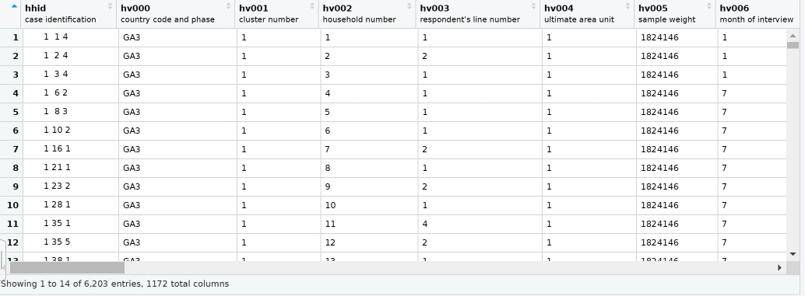
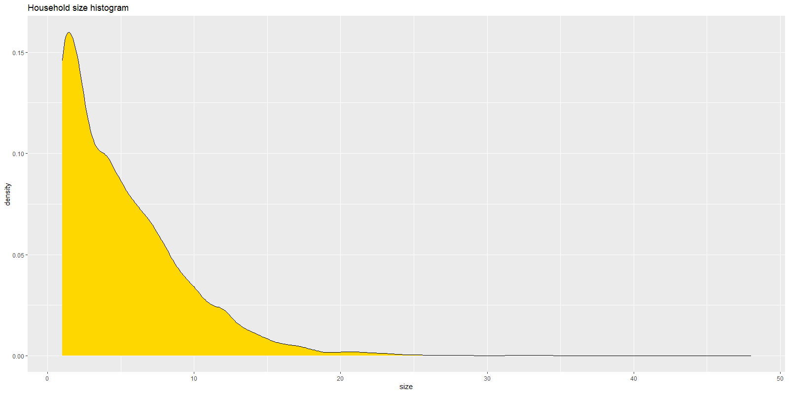
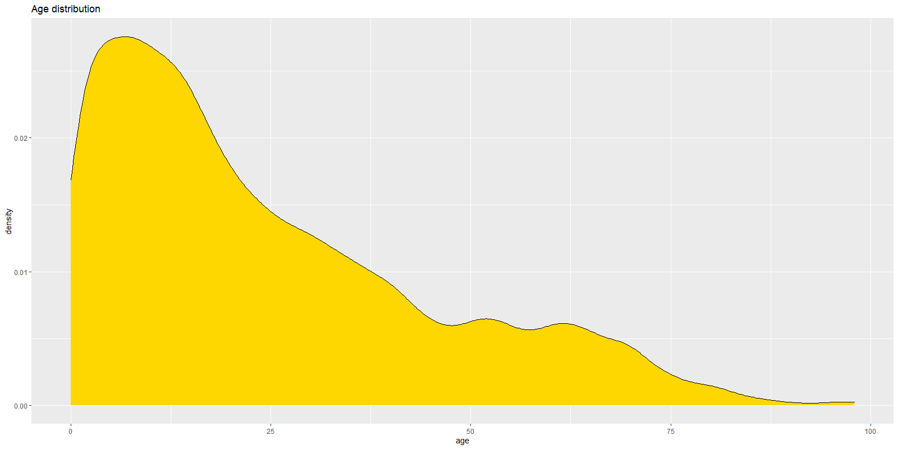
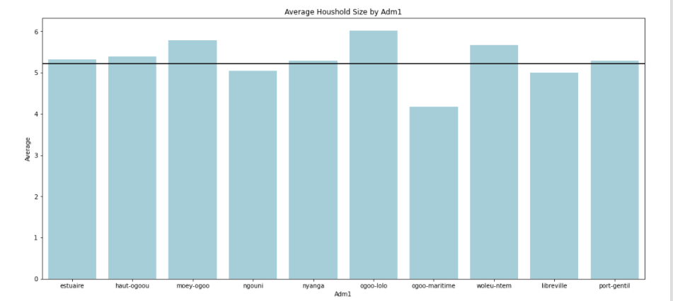
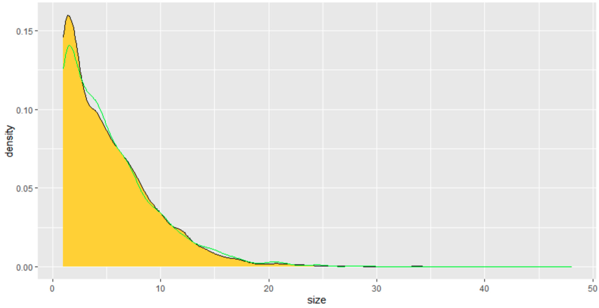
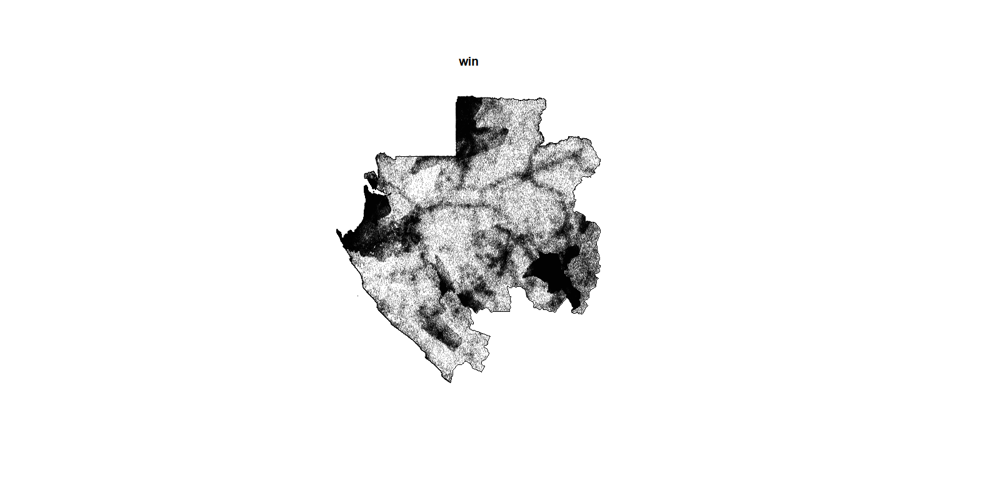

## Project 2 - Generating Synthetic Populations


### Provide a written description of your selected household survey including the number of household and person observations as well as the variables in your source data.

To start with I had to request my household data from https://dhsprogram.com/. Once approved, I had access to both Gabon's 2012 and 2000 census, I chose to use the data from 2012 as it was the most up to date. 

In Gabon's 2012 census, field reporters visited 6203 households across Gabon and reported around 17 different questions give or take (1107 columns of data, asked on 48 potential household members).




Variables used for this project:

* Household ID : hhid
* Unit: hv004
* Weight: hv005
* Location: shprov
* Gender: hv105_X
* Age: hv104_X
* Education (In years): hv108_X

The overall distribution of household size can be seen below



* We can see a far right skew, which makes sense as the average household size is 5.22, and houses cannot have a negative value meaning the distribution must spread out right.
* Quantile Distribution
  * 0% - 1 
  * 25% - 2
  * 50% - 4
  * 75% - 7
  * 100% - 48


Next we will explore the age distribution of Gabon.




* From this graphic we can see that a majority of Gabon's population, this might be a result of a baby boom in the last 30 years AND / OR, a very short life expectancy in comparison to first world countries. I would be very interested to see the age distribution of neighboring countries to see if this distribution is isolated to Gabon or not.


### Provide a written description of your spatially located households at the adm0 level of your selected location, including how you located each household, generated the household structure including demographic attributes of persons, and the percent error calculated. If you faced computational issues at the adm0 level when attempting to pivot from households to persons, describe those limitations.

To find my households at the adm0 level of Gabon I calculated the average number of households of Gabon (population size from raster file / average household size in DHS survey).

Next I randomly generated points with the rpoint function, using the population density data as a reference  to somewhat normalize the randomness of rpoint. 

I then pivotted my household data, transforming my data to be more relevant to a per person survey. This took my original datatable of 6203 observations to a table with just under 33,000 observations.

Interestingly, DHS had recorded sex in their survey as "male" ,"female", and "" for null values instead of 1,0, N/A. As a result, when I pivotted (code seen below), my null values stayed in my table. 

```R
gender_pivot <- gender_pivot %>%
	gather(key='pnmber', value='gender', colnames(gender_pivot)[6:53], na.rm=T)
```

To fix this, I had to go in by hand and filter out null values with the code.

```R
gender_pivot <- gender_pivot %>%
	filter(gender!="")
```

Using the slice sample function I expanded my sample data to replicate the population of Gabon, this is where my computer began to struggle with the size of my data. 

I then calculated that I had an weighted error of approximately 6%, which is not terrible but not great either.

### Provide a written description of your spatially located households at the adm1 or adm2 level of your selected location, again including how you located each household, generated the household structure including demographic attributes of persons, and the percent error calculated. Further analyze your synthetically generated households and persons with regard to percent error. Do you think this population is more or less accurate than the one generated at the adm0 level? What could you have done to improve your measures of accuracy?

Generally, I wished the gps location (longitude / latitude) was included in the  DHS survey so we could potentially use a K nearest neighbors algorithim to accurately extrapolate the survey data to the country's population on a more accurate basis. However doing such would probably lead to violation in data privacy laws. An alternative to including direct gps locations, the DHS surveyed could have also included what adm2 the surveyed household came from, as it currently only included adm1 data. This would help us narrow down a population distribution to an even smaller population.

Based off of that thinking, I believe that a synthetic population generated at the adm2 level is more accurate to the local population than generating a population at the adm0 level. This is the case as by narrowing our sample to survey results. A great example of this can be seen in the distribution of average household size across Gabon.




In the graph above, we can see the differences in average household size across the different adm1s (The horizontal black line represents the national average household size).

As we can see, certain adm1s have slightly higher / lower size averages, and Ogoo-maritime specifically has a notebally lower average. Such variance might not be properly extrapolated to a synthetic population if we use a population spread across the Gabon. 

#### Analysis of synthetic populations

Below is the graph of the household distribution using all of Gabon. The generated distribution does well in capturing most of the variation of household size across Gabon, but is not perfect as it cannot capture the differences in variation across individual adm1s. 

*For some reason I was not able to generate a distribution using just the Woleu's (my selected adm1) distribution my computer kept crashing.




### When compared to a randomly generated synthetic population that describes the demographic attributes of households and persons, does yours more closely approximate reality? How is yours an improvement over a synthetic population that was generated in accordance with complete spatial randomness? Generate plots and incorporate results from your work as evidence in support of an argument that the synthetic population you generated is a good approximation of the reality that existed in your selected location at that given time.


I believe that I was able to generate a synthetic population better than a randomly generated one. In my opinion, when we use any source of data to hotdeck another variable we are doing a better job than randomly assigning a value. For example, when filling education in years, an individual who is 13 years old may be randomly assigned 12 years of education which simply would not make sense, however, with an input value of age =12 we are hoping that machine learning algorithims will be able to rule out 12 years of education as a possibility by seeing that our train data has no pair of (13 years old, 12 years of education). 

Additionally, a randomly generated population generates household locations randomly, however, my synthetic population utilizes population density data from the raster file. As a result, my generated population is more accurate because it tries to replicate settling patterns of the Gabon's general population.




