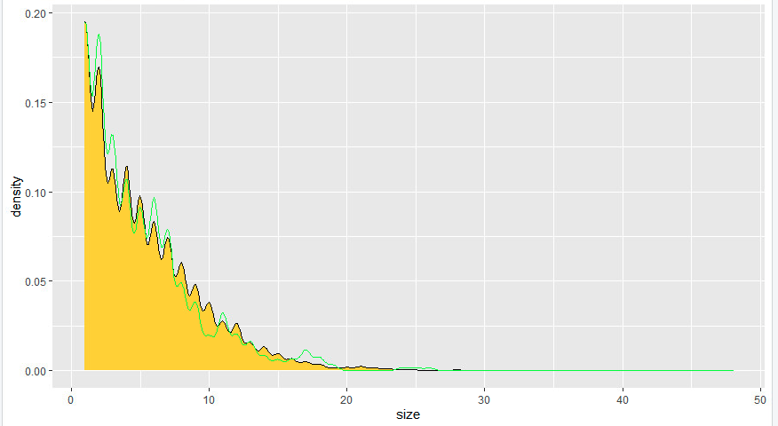
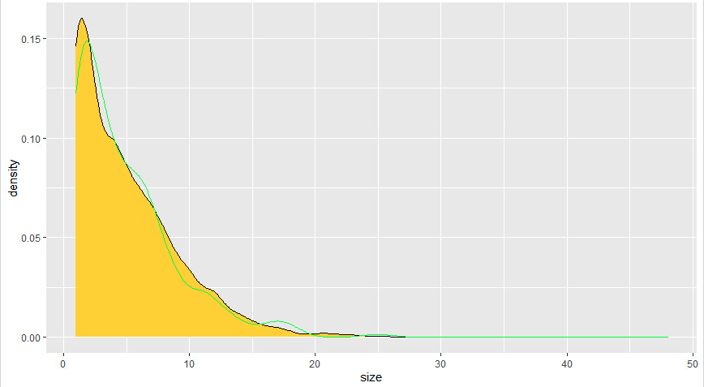

- ## Project 2 - Generating Synthetic Populations

  

  ### Provide a written description of your selected household survey including the number of household and person observations as well as the variables in your source data.

  To start with I had to request my household data from https://dhsprogram.com/. Once approved, I had access to both Gabon's 2012 and 2000 census, I chose to use the data from 2012 as it was the most up to date. 

  In Gabon's 2012 census, field reporters visited 6203 households across Gabon and reported around 17 different questions give or take (1107 columns of data, asked on 48 potential household members).

  

  

  

  Variables used for this project:

  * Household ID : hhid
  * Unit: hv004
  * Weight: hv005
  * Location: shprov
  * Gender: hv105_X
  * Age: hv104_X
  * Education (Still in school): hv111_X

  The overall distribution of household size can be seen below

  

  * We can see a far right skew, which makes sense as the average household size is 5.22, and houses cannot have a negative value meaning the distribution must spread out right.
  * Quantile Distribution
    * 0% - 1 
    * 25% - 2
    * 50% - 4
    * 75% - 7
    * 100% - 48

  

  Next we will explore the age distribution of Gabon.

  

  

  * From this graphic we can see that a majority of Gabon's population, this might be a result of a baby boom in the last 30 years AND / OR, a very short life expectancy in comparison to first world countries. I would be very interested to see the age distribution of neighboring countries to see if this distribution is isolated to Gabon or not.

It should be noted that the DHS household sum of weights before any transformation of the data is not 100% accurate. 


### Provide a written description of your spatially located households at the adm0 level of your selected location, including how you located each household, generated the household structure including demographic attributes of persons, and the percent error calculated. If you faced computational issues at the adm0 level when attempting to pivot from households to persons, describe those limitations.

I was unable to complete this section of the project due to computational power when pivotting from households to persons.

Ideally (if computational power was not a concern), the process of spatially locating households at the adm0 level would have 4 steps:

1) Calculate the number of households to generate

```R
gab_hhs_n <- floor(cellStats(gab_pop18,'sum')/mean(hhs$size))
```

2) Use the rpoint function to randomly locate houses across Gabon and append them to our household dataset, giving an observation a synthetic location in the country

```R
st_write(gab_adm0,'gab_adm0.shp',delete_dsn = TRUE)
gab0_mt <- readShapeSpatial('gab_adm0.shp')
win <- as(gab0_mt,'owin')

hhs_pts <- rpoint(gab_hhs_n, f=as.im(gab_pop18),win =win)
pts <- cbind.data.frame(x=hhs_pts$x, y=hhs_pts$y)
hhs_locs <- st_as_sf(pts, coords = c('x','y'), crs=st_crs(gab_adm0))
```

3) Use slice sample to expand the DHS data from 6203 observations to the number of households desired (In our case this is 535285) and create a new dataframe

```R
hhs_pop <- slice_sample(hhs, n=gab_hhs_n, replace=T)
gab_hhs_locs <- cbind.data.frame(hhs_pop, hhs_locs)
```

4) Calculate error (for me this was 0.000123157)

```R
abs((nrow(gab_hhs_locs) - sum(gab_hhs_locs$weights))/nrow(gab_hhs_locs))
```


### Provide a written description of your spatially located households at the adm1 or adm2 level of your selected location, again including how you located each household, generated the household structure including demographic attributes of persons, and the percent error calculated. Further analyze your synthetically generated households and persons with regard to percent error. Do you think this population is more or less accurate than the one generated at the adm0 level? What could you have done to improve your measures of accuracy?

The one difference between generating a population from adm1 data and adm0 data, is that we are going to subset our household data to a specific adm1 before starting the process.

```R
wol_hhs <- subset(hhs, location==9)
```

The argument between generating a sample between adm1 and adm0 comes down to a size of sample vs error decision, and we have to somewhat pick our poison. 

When sampling from my adm1, I am only have ~ 600 observations to generate an observation for my adm1 region (Wouleu-Ntem). However, when I sample from the adm0 level I have ~6000 observations to generate a population from, with the consequence of potentially having data that does not pertain to my chosen adm1 to be a part of the generated population for that adm1. For example, if the Wouleu-Ntem region have an average size household of 6 members but the greater Gabon has an average of 3 members, our generated population of Wouleu-Ntem will have an average household size of 3 not 6 (We can see this in figure 3.1).

#### Figure 3.1: Differences in Average Household Size by ADM1


* Figure 3.1 illuminates the differences in ADM1's of Gabon by visualizing the average household size by ADM1

#### Figure 3.2: Realized vs Generated Household Size (ADM0)



#### Figure 3.3: Realized vs Generated Household Size (ADM1)




Due to the fact that the Woleu-Ntem size distribution folllows the national average so similarly that we have no arguement for not to use ADM0 data to generate our synthetic population.


#### When compared to a randomly generated synthetic population that describes the demographic attributes of households and persons, does yours more closely approximate reality? How is yours an improvement over a synthetic population that was generated in accordance with complete spatial randomness? Generate plots and incorporate results from your work as evidence in support of an argument that the synthetic population you generated is a good approximation of the reality that existed in your selected location at that given time.

will finish tomorrow
